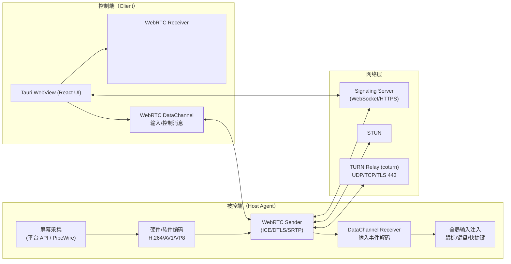

# 跨平台远程桌面控制（Tauri + Rust + React）端到端技术实施计划

面向：Windows / macOS / Linux（X11 + Wayland）  
现有架构：Tauri（Rust 主进程）+ TypeScript + Vite + React（WebView 前端）  
目标：低延迟画面传输 + 高同步性输入控制 + 复杂网络环境下的稳定连接 + 跨平台可落地

---

## 0. 前提与边界（明确“能做到/做不到”）

### 产品形态建议
- **被控端（Host Agent）**：运行在被控机器，负责屏幕采集、编码、网络发送、输入注入（可做成后台常驻/系统服务）。
- **控制端（Client Controller）**：运行在控制机器，负责 UI、接收视频渲染、采集本地交互并通过网络发送到被控端。
- 两端都可以使用同一套仓库/代码（feature 切分），但职责要严格拆分：**Host 负责“采集+编码+注入”，Client 负责“渲染+输入发送”**。

### 关键现实约束（必须提前接受/设计绕过）
- **Wayland 全局输入注入受限**：通用 Wayland 环境下“随意注入鼠标键盘到别的应用”通常不可行，常见可行路线是：
  - 通过 **uinput** 模拟虚拟输入设备（往往需要 root/`CAP_SYS_ADMIN` 或 setcap）
  - 或依赖 compositor/桌面环境提供的远控接口（GNOME Remote Desktop 等）
  - 或明确：Linux Wayland 仅支持“观看”/部分控制，完整控制推荐 X11 或需要额外权限
- **macOS 权限**：屏幕录制（Screen Recording）与辅助功能（Accessibility）权限缺一不可；企业环境还涉及签名、沙盒与权限描述。
- **编码格式兼容性**：
  - **H.264** 是 WebRTC 兼容性最好的“默认选择”
  - **H.265** 在 WebRTC/浏览器端支持并不普遍（尤其 WebKit）；可作为后续实验/私有传输选项
  - **AV1** 生态在成长（现代浏览器/硬件支持更好），但老设备可能不支持硬件编解码
- **分发/许可风险**：H.264/H.265 可能涉及专利/授权；GStreamer/FFmpeg 的依赖、许可证与打包策略要提前评估。

---

## 1. 架构设计图（Rust 主进程、WebView 前端、网络层交互）

### 1.1 总体组件与数据流

**关键逻辑**：
- **视频链路**：Host 采集 → 编码 → WebRTC Video Track（SRTP）→ Client `<video>` 渲染（硬件解码优先）
- **输入链路**：Client 捕获鼠标/键盘事件 → DataChannel → Host 解析 → 平台输入注入
- **信令链路**：Client/Host 通过 Signaling Server 交换 SDP/ICE；ICE 失败时走 TURN 中继

### 1.2 连接建立与重连（推荐状态机）

1) Client/Host 通过 HTTPS 登录/获取会话 token  
2) 建立 WebSocket（或 SSE）进行信令交换  
3) ICE Gathering：优先直连（STUN），失败则使用 TURN（UDP→TCP→TLS）  
4) 建立 WebRTC：DTLS-SRTP + SCTP DataChannel  
5) 运行中：周期性 Stats 采集（RTT/丢包/抖动/码率）→ 自适应码率/帧率  
6) 断线：分级重连策略（ICE restart / 完整重协商 / 重新登录）

---

## 2. 关键技术选型（库、协议、推荐组合）

> 下面按“推荐优先级”给出可落地的组合，并明确适用场景与风险。

### 2.1 低延迟画面传输：采集 + 编码 + 传输 + 渲染

#### A. 推荐路线（工程成熟优先）：**GStreamer（Host）+ WebRTC（webrtcbin） + WebView JS WebRTC（Client）**
- **优点**：跨平台媒体管线成熟；硬件编解码生态最好；webrtcbin 可一站式处理 ICE/DTLS/SRTP/拥塞控制/重传。
- **缺点**：依赖体积大；Linux/Windows/macOS 打包复杂；需要维护 GStreamer 插件可用性。
- Rust crates：
  - `gstreamer`, `gstreamer-app`, `gstreamer-video`
  - `gstreamer-webrtc`（或直接使用 webrtcbin 元件）
- 编码器选择（按平台与硬件）：
  - Windows：`d3d11h264enc` / `nvh264enc` / `vah264enc`（视环境）
  - macOS：`vtenc_h264`（VideoToolbox）
  - Linux：`vaapih264enc` / `nvh264enc`
- 传输协议：WebRTC（RTP/RTCP + SRTP）  
- 前端渲染：`<video>` 接收 `MediaStream`，低延迟模式（禁用额外缓冲/在可控范围内降低 jitter buffer）

#### B. 可控性更强（Rust 纯栈倾向）：**webrtc-rs +（FFmpeg/GStreamer 编码）+ 自行做 RTP 封包**
- **优点**：更“Rust 原生”；依赖可控；可深度定制数据通道与协议。
- **缺点**：你需要自己处理更多媒体细节（RTP packetization、关键帧、码率控制、时间戳、丢包策略）。
- Rust crates：
  - WebRTC：`webrtc`（社区常称 webrtc-rs）
  - 编码：`rsmpeg` 或 `ffmpeg-next`（FFmpeg bindings），或仍用 `gstreamer` 仅做编码
  - 网络/异步：`tokio`, `bytes`
- 编码建议：
  - MVP：`openh264`（软件 H.264）或 VP8（libvpx via FFmpeg）
  - 优化：FFmpeg 硬编（NVENC/VAAPI/VideoToolbox/D3D11VA/QSV）

#### C. QUIC/自定义传输（用于特定场景/备选）：**QUIC (quinn) + 编码流 +��WebCodecs 或 Rust 解码）**
- **优点**：控制面 + 媒体面可统一在 QUIC；在某些网络环境下更易穿透（但仍依赖 UDP）。
- **缺点**：浏览器/WebView 端的解码与渲染会成为最大不确定性（WebCodecs 支持差异，尤其 WebKit）。
- Rust crates：
  - QUIC：`quinn` 或 `s2n-quic`
  - 加密：`rustls`
  - 码流封装：自定义（类似 RTP）+ FEC/重传策略
- 适用：企业内网/自有客户端（非 WebView）更适合；WebView 端要谨慎评估。

**结论建议**：  
MVP 与第一版跨平台建议 **WebRTC 优先**；工程上最稳的是 **A 路线（GStreamer+webrtcbin）**，如果你愿意承担打包复杂度。若你更偏向“Rust 纯栈、少依赖”，选 **B 路线**但要投入更多媒体工程工作量。

---

### 2.2 屏幕捕获（Screen Capture）：跨平台策略与 crates

#### 统一抽象
- 定义统一能力模型：显示器枚举、分辨率、刷新率、像素格式、是否支持零拷贝（GPU texture / DMABUF / IOSurface）。
- 把“采集”与“编码”解耦：采集层输出 `Frame { timestamp, format, planes/texture }`，编码层做协商与转码。

#### Windows
- 推荐 API：**Desktop Duplication API（DXGI + D3D11）**
- Rust crates：
  - `windows`（官方 Windows API bindings）
- 关键点：
  - 尽量维持在 GPU 纹理路径（D3D11 texture）减少拷贝
  - 多显示器、DPI 缩放、鼠标指针形状单独处理（指针图像可单独通道发送）

#### macOS
- 推荐 API：
  - 现代优先：**ScreenCaptureKit**（更好的性能与能力）
  - 兼容方案：CGDisplayStream / CoreGraphics
- Rust crates（视方案与绑定成熟度）：
  - `objc2`（与系统框架交互）
  - `core-graphics`, `core-foundation`（基础类型/调用）
- 权限：
  - Screen Recording（屏幕录制）
  - Accessibility（辅助功能，用于输入注入）

#### Linux（X11 vs Wayland）
- X11：
  - API：XShm / XDamage（或依赖成熟库封装）
  - Rust crates：`x11rb`（或其它 X11 bindings）
- Wayland：
  - 推荐：**PipeWire + xdg-desktop-portal**（现代桌面通用方案）
  - Rust crates：
    - `ashpd`（xdg-desktop-portal 交互）
    - `pipewire`（PipeWire bindings）
- 风险：Wayland 下采集通常需要用户授权弹窗，且桌面环境差异大；需要做大量兼容测试矩阵。

#### 快速落地（MVP）可选 crate
- `scrap`：快速跨平台采集（但 Wayland 支持弱/无，且对高性能路径限制多）
- 建议将 `scrap` 仅作为 MVP 或 X11/Windows 的“兜底实现”，后续逐平台替换为原生高性能实现。

---

### 2.3 高同步性操作：输入注入（Input Injection）与事件模型

#### 事件协议（跨平台统一）
- 鼠标：
  - move（绝对/相对）、button down/up、wheel
  - 坐标建议用 **归一化**（0..1）+ 远端 display id，避免分辨率变化导致漂移
- 键盘：
  - 发送 `code`（物理键位）+ `modifiers`（ctrl/alt/shift/meta）
  - 需要处理：组合键、长按重复、IME 输入（可后续做文本注入通道）
- 系统快捷键：
  - 提供 UI/快捷按钮发送（如 Ctrl+Alt+Del、Cmd+Tab），避免被本机系统拦截

#### Windows 注入
- API：`SendInput`（必要时配合 scancode）
- crate：`windows`
- 注意：
  - 注入到高权限窗口可能受限（权限边界）
  - 鼠标绝对坐标需要映射到虚拟桌面坐标系（多屏/缩放）

#### macOS 注入
- API：Quartz Event Services（`CGEventCreate...` / `CGEventPost`）
- crates：`core-graphics`（或通过 `objc2` 调用）
- 权限：Accessibility 必须开启

#### Linux 注入
- X11：
  - API：XTest extension（模拟键鼠）
  - crate：`x11rb`
- Wayland：
  - 通用难点：多数环境不允许无特权全局注入
  - 路线 1：`uinput` 虚拟输入设备（需要权限/能力位）
  - 路线 2：依赖 compositor 的远程控制协议（生态碎片化）
- 结论：**Wayland 完整控制需要明确的权限策略或平台限制说明**。

#### 候选通用 crate（MVP 快速实现）
- `enigo`：跨平台键鼠注入封装（适合 MVP，但 Wayland 支持受限）
- 建议：MVP 用 `enigo` 快速跑通；后续逐平台替换为更可控的原生实现（尤其 Windows/macos）。

---

### 2.4 连接稳定性：信令服务器 + NAT 穿透失败的中继方案

#### 推荐网络策略（从易到难）
1) **ICE + STUN** 尝试直连  
2) 失败 → **TURN Relay（coturn）** 中继（优先 UDP，其次 TCP，最后 TLS 443）  
3) 极端环境 → 允许“仅控制通道”降级（例如先保证连上、画面可降帧/降分辨率）

#### Signaling Server 设计（最小可行 + 可扩展）
- 协议：HTTPS + WebSocket（或 WebTransport/HTTP3 可后续）
- 功能：
  - 鉴权（JWT/短期 token）、设备注册、会话创建/加入、SDP/ICE 消息转发
  - 房间/会话生命周期管理、断线重连、限流
- Rust crates（服务端）：
  - Web：`axum`（或 `warp`/`actix-web`）
  - WS：`tokio-tungstenite`
  - 序列化：`serde`
  - 认证：`jsonwebtoken`（可选）

#### TURN
- 方案：**coturn（强烈推荐）**
- 关键配置：
  - 长期凭证（长期密钥 + 动态生成 username/password）
  - 端口策略：UDP 3478 + TLS 5349 + 443/80 伪装（视部署）
  - 资源限制与审计：带宽上限、并发数、速率限制、日志

#### 是否需要 SFU/中继网关？
- 1v1 远控：TURN 足够
- 需要“多控制端观看/协作”、录制、云端分发：引入 **SFU（Selective Forwarding Unit）**（后续阶段）
  - 可选：现成 SFU（mediasoup/ion-sfu 等）+ 自己的信令层

---

## 3. 分步实施路线图（MVP → 跨平台 → 性能优化）

> 每一阶段都给出：目标、关键交付物、主要风险与验收指标。

### Phase 0：基础工程与协议骨架（1–2 周）
**目标**：先把“可维护性与边界”搭好，避免后面越做越乱。  
交付物：
- Host/Client 角色拆分（同仓库不同 feature 或不同二进制）
- 统一消息协议定义（信令消息、DataChannel 控制消息、能力协商）
- 统一日志/指标：`tracing`，关键链路打点（采集→编码→发送→渲染端到端延迟）
验收指标：
- 能在本机启动 Host/Client 两端，完成“空会话”建立与断开（不传媒体也行）

### Phase 1：MVP（本地网络 1v1，画面+鼠标基本控制）（2–4 周）
**目标**：跑通端到端体验，先有“能用的远控”。  
建议范围（降低不确定性）：
- 优先选择 **Windows 或 macOS** 作为首个完整平台；Linux 先做 X11（Wayland 后置）
视频：
- 采集：`scrap` 或平台原生 API（建议 Windows 直接上 Desktop Duplication）
- 编码：软件 H.264（`openh264` 或 FFmpeg 软件编码）
- 传输：WebRTC（webrtc-rs 或 GStreamer webrtcbin）
输入：
- `enigo` 或平台原生注入（优先保证鼠标点击/移动/滚轮）
验收指标：
- 端到端延迟：本地 LAN 下可做到“可交互”（通常目标 < 150ms，越低越好）
- 画面稳定无明显卡顿；输入不丢、不抖（基本同步）

### Phase 2：网络可用性（NAT 穿透 + TURN 兜底 + 重连）（2–3 周）
**目标**：让真实网络环境“连得上、不断线”。  
交付物：
- Signaling Server（WS）上线：会话/设备管理、鉴权、SDP/ICE 转发
- coturn 部署 + 动态凭证签发
- 客户端重连策略（ICE restart、断线重协商）
验收指标：
- 典型 NAT/企业网络下可稳定连接；失败时能自动切 TURN
- 长时间运行（> 30 分钟）无明显音画断流（视频可先无音频）

### Phase 3：跨平台补齐（Linux X11 → Wayland，macOS 权限/签名完善）（3–6 周）
**目标**：把“能用”扩展到三大平台的主流环境。  
交付物：
- Linux X11：采集 + 注入稳定
- Linux Wayland：优先实现“观看”（PipeWire portal），控制功能按权限策略推进
- macOS：权限引导流程完善（检测是否授权、跳转系统设置、失败提示）
- Windows：多屏/DPI 映射正确
验收指标：
- 三平台在目标桌面环境下跑通；失败路径可解释、可引导用户解决

### Phase 4：性能与画质（硬件加速编码 + 自适应码率 + 低延迟调优）（4–8 周）
**目标**：从“能用”升级到“好用/接近商业体验”。  
交付物：
- 硬件编码：
  - Windows：NVENC/AMF/QSV/D3D11VA（择优与可用性探测）
  - macOS：VideoToolbox H.264（必做）
  - Linux：VAAPI/NVENC
- 关键帧策略：按需请求 IDR，快速恢复
- 自适应码率：基于 WebRTC stats（RTT/丢包/带宽估计）动态调整分辨率/帧率/码率
- 降带宽技巧：
  - 光标分离（cursor shape/pos 单独发送）
  - 降噪/降采样、降低色度采样、只在变化时提高帧率
验收指标：
- 1080p60（视硬件）可稳定；弱网下降级平滑、可交互不“崩”

### Phase 5：产品化能力（安全、权限、可运维）（持续迭代）
安全：
- WebRTC 自带 DTLS-SRTP 加密；在此之上做设备身份与会话授权
- 可选 E2EE（端到端应用层密钥）用于高安全场景（需要更复杂的密钥管理）
可运维：
- 连接质量与性能指标上报（RTT、丢包、帧率、码率、CPU/GPU 占用）
- 崩溃收集与日志（注意隐私与合规）
体验增强：
- 音频（Opus）、剪贴板同步、文件传输、会话录制（可后续）

---

## 4. 研发风险清单（建议提前验证的“坑位”）

1) **Linux WebView 的 WebRTC 能力差异**（WebKitGTK 依赖与插件）：需要尽早做原型验证与打包验证。  
2) **Wayland 输入注入权限问题**：明确产品策略（要么要求权限/额外 helper，要么限制功能）。  
3) **硬件编码可用性探测与回退**：必须做“能力协商+多路回退”，否则现场环境很容易不可用。  
4) **多屏/DPI/坐标映射**：这是远控输入“手感差”的最大来源之一，必须做严谨的坐标体系。  
5) **专利与分发**：H.264/H.265 相关授权与依赖分发策略要提前对齐（尤其商业发布）。

---

## 5. 推荐的第一性工程决策（落地建议）

- **协议优先选 WebRTC**：视频用 Video Track，输入用 DataChannel，NAT 问题用 TURN 兜底。
- **编码优先选 H.264**：兼容性最高；AV1 作为后续“高效模式”。
- **Host 端媒体管线优先 GStreamer webrtcbin**（如果可接受依赖/打包）：能最快获得硬编、拥塞控制、抗丢包与生态优势。
- **Linux Wayland 策略提前定**：要么接受限制，要么设计权限/辅助进程。

